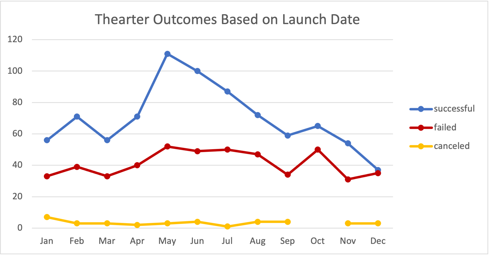

# Kickstarter Data Analysis

# Overview of Project

We looked at historical Kickstarter campaign data from 2010-2017 to uncover relationships, trends, and patterns of the campaign's outcome in relation to their goals and launch dates.

## Areas of focus: 
- In the analysis of outcomes vs launch date, we specifically investigated the outcomes of campaigns in the "theater" parent category.
- In the analysis of outcomes based on goals, we specifically looked at campaigns in the "plays" subcategory.

## Purpose
The purpose of this analysis is to determine which is the best month to launch a successful campaign and to determine if Louise should consider adjusting her goal for her next campaign.

---
# Analysis and Challenges

In this line graph, we see a trend between launch date and outcome. We see that there is a spike in the number of the total campaigns launched between April and May. This chart shows that May is the most active month for launching a campaign in the theater category. After the peak in May, there is a gradual downward trend in the number of total theater campaigns launched. 

In this example, this line graph illustrates a pattern between launch date and number of successful outcomes from 2010-2017. The last several years follow very similar trends as the previous years.
- May-July represents the most active months in terms of number of successful campaigns launched for the month.

This line graph shows the relationship between the goals and outcomes of the campaigns. Louise's goal was between 10-12k, so we will focus on the campaigns that had a goal less than or equal to 20k.

Notice, as the goal increases, the percentage of failure increases. Meaning the higher the goal, the more likely you will fail at reaching your goal. Similarly, as the goal increases, the number of successful campaigns decreases.

In this bar graph, we see a trend in goals and number of successful campaigns between the months of May-July.  

- Note that across all years, approximately 60% of successful campaigns launched during May - July had a goal between 1-5K.
- An average of 14% of the successful campaigns had a goal of 5k-10k.
- Only 6% had a budget of 10-14K (similar to Louise's goal)

---
# Results

## Analysis of Outcomes Based on Launch Date
---

### - Conclusion One -

Historically, May - July are the most active months for launching campaigns in the theater category. Accordingly, approximately 65% of those who launch a campaign in those months are successful.

One factor can be related to "theater season", or the season when new plays are produced. This would be the time when more producers are actively seeking funding for their projects. Let’s assume plays take an average of 4-6 months to produce, and that most plays are performed during the fall season.
##### Source: https://www.quora.com/On-average-how-long-does-it-take-to-produce-a-theatre-production

We would expect that theater season is taking place during the summer, which is why more campaigns being launched and a higher percentage of successful outcomes during these months. As producers reach their funding goals and fall season approaches, we see a slow and steady decline in terms of number of successful campaigns launched per month.

High activity during these months presents a challenge: one must compete against more producers looking for funding.

### - Conclusion Two -
Based on the "Goals of Successful Campaigns 2010-2017" chart, we can see a trend in the number of successful campaigns broken into goal ranges:
- If your goal is between 1-5k, you have a 75% chance of having a successful campaign.
- If you have a goal between 5-10k, you have a 17% chance of having a successful campaign.
- If you have a goal between 10-15k, you have a 7% chance of having a successful campaign.

## Analysis of Outcomes Based on Goals
---

### - Conclusion - 
Louise came close to her goal of the 10-12k range. If Louise would have launched a campaign with a goal under 10K, she would have had an extra 10% chance of having a successful outcome.

## Challenges and Difficulties Encountered
---

### Limitations of the dataset
One thing we have limited insight on is how actively is the campaign being promoted?
- Is this a major factor in driving the outcome of a campaign? If so, by how much?

### Recommendations

Louise had mentioned 5 plays that inspired her during the Edinburg Festival Fringe:
- Be Prepared
- Checkpoint 22
- Cutting Off Kate Bush
- Jestia and Raedon
- The Hitchhiker's Guide to the Family

Each of these plays had a goal between 1k-5k. They all launched in Jun/July. Louise should consider adjusting her goal lower if she wants a significantly much higher chance of having a successful outcome. She should look into implementing ideas from the plays that inspired her initially. If Louise launches the next campaign during the most active months of the year (May-July), she needs to make sure to leverage all her social platforms, and promote her campaign as much as possible. There will be more completion for funding.
